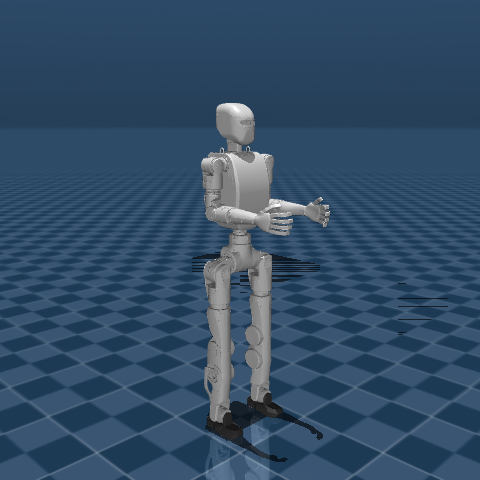

# ROBOTIS AI Sapiens K1 Description (MJCF)

## Overview

This directory contains an MJCF description of the
[ROBOTIS AI Sapiens K1](https://docs.robotis.com/docs/systems/aisapiens/introduction)
humanoid robot and its STL meshes.

  

## MJCF derivation steps

1. Started from the K1 URDF in the `ai_sapiens_description` package.
2. Added `<mujoco><compiler discardvisual="false" fusestatic="false"/></mujoco>` to the URDF and resolved the ROS package mesh paths.
3. Loaded the URDF into MuJoCo and saved the corresponding MJCF.
4. Added a free joint and an IMU site to the pelvis.
5. Added motor actuators with torque limits and armature values from the actuator specifications.
6. Set the integrator to `implicitfast`.
7. Added orientation, gyroscope, and accelerometer sensors for the IMU.
8. Added a home keyframe.
9. Added `scene.xml` with the ground plane, lighting, skybox, and haze.

## License

This model is released under the [Apache License 2.0](LICENSE).
